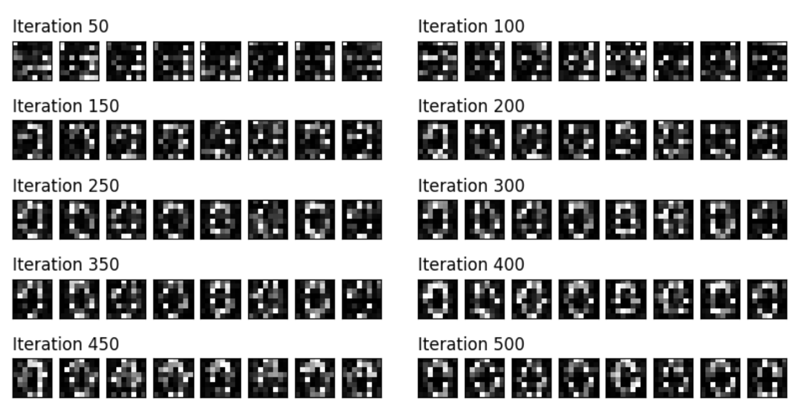
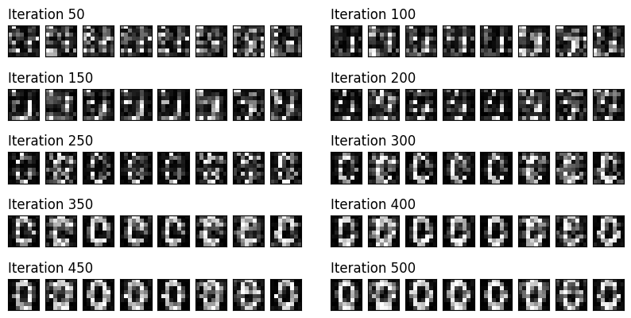

# Quantum General Adversial Networks
The [notebook](./qgan.ipynb) implements QGAN following the code from Pennylane tutorial: https://pennylane.ai/qml/demos/tutorial_quantum_gans.
The code is tweaked to be compatible for training on Metal Performance Shaders (MPS) backend.
In addition, the following changes are done to achieve better results:
- Initial state is encoded using Rx gates instead of Ry gates used in tutorial
- The generator is updated once for every 3 gradient steps of the discriminator.
- The learning rate of discriminator is relative to generator's learning rate by factor of 0.01.


### Training results from tutorial:

<br/>
<br/>

### Training results from this notebook:



### Installation
- Setup virtual environment
```bash
python3 -m virtualenv venv
```
- Activate virtual environment
```bash
source venv/bin/activate
```
- Install requirements.txt
```bash
pip install requirements.txt
```


